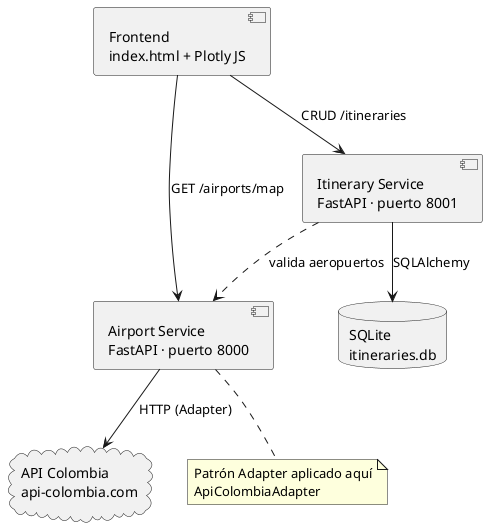
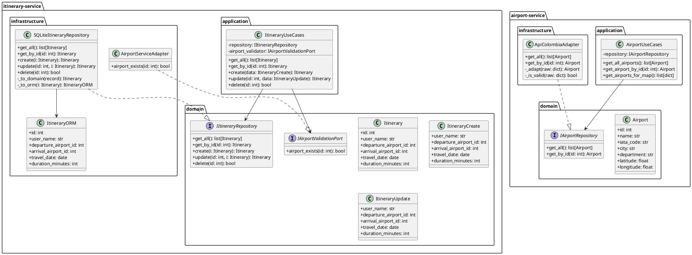
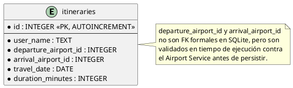

# Sistema de Itinerarios Personales
### Arquitectura de Microservicios · Universidad Central · Arquitectura de Sistemas II

---

## Descripción

Sistema web para gestionar itinerarios de viaje entre aeropuertos colombianos. Construido sobre una arquitectura de microservicios con dos servicios independientes que se comunican entre sí, y un frontend que los consume.

---

## Tecnologías utilizadas

| Capa | Tecnología |
|---|---|
| Backend | Python 3.12 + FastAPI |
| Validación | Pydantic v2 |
| Base de datos | SQLite + SQLAlchemy |
| Frontend | HTML + Vanilla JS + Plotly JS |
| Contenerización | Docker + Docker Compose |

---

## Arquitectura utilizada

El proyecto implementa **Arquitectura Hexagonal (Ports & Adapters)** en cada microservicio. El objetivo es aislar la lógica de negocio del mundo exterior — bases de datos, APIs externas y frameworks — de manera que ninguna de esas cosas externas contamine el núcleo de la aplicación.

Cada microservicio está organizado en cuatro capas:

- **domain** — entidades y puertos (interfaces abstractas). No tiene dependencias externas.
- **application** — casos de uso que orquestan la lógica de negocio usando los puertos.
- **infrastructure** — adaptadores concretos que implementan los puertos (API Colombia, SQLite, HTTP).
- **api** — controladores FastAPI que reciben las peticiones del exterior.

---

## Diagrama de componentes

```
┌────────────────────────────────────────────────────────────┐
│                         FRONTEND                           │
│              index.html  +  Plotly JS                      │
└────────────┬───────────────────────┬───────────────────────┘
             │ GET /airports/map     │ CRUD /itineraries/
             ▼                       ▼
┌──────────────────────┐   ┌──────────────────────────────┐
│   AIRPORT SERVICE    │   │      ITINERARY SERVICE        │
│     puerto :8000     │◄··│  valida aeropuertos :8001    │
└──────────┬───────────┘   └──────────────┬───────────────┘
           │ HTTP (Adapter)                │ SQLAlchemy
           ▼                              ▼
  ┌─────────────────┐           ┌──────────────────┐
  │   API Colombia  │           │  itineraries.db  │
  └─────────────────┘           └──────────────────┘
```

PlantUML:



---

## Diagrama de clases



---

## Diagrama relacional



---

## Explicación del patrón Adapter implementado

El patrón Adapter desacopla la API externa del dominio interno. `IAirportRepository` define el contrato que el resto del sistema conoce. `ApiColombiaAdapter` implementa ese contrato traduciendo la respuesta externa al modelo `Airport`. El frontend y el Itinerary Service nunca conocen la estructura de la API de Colombia.

```
IAirportRepository     ← Puerto (interfaz abstracta / Target)
       ▲
       │ implementa
ApiColombiaAdapter     ← Adapter concreto
       │
       │ consume
api-colombia.com       ← Adaptee (API externa)
```

La gran ventaja es que si la API Colombia cambia su estructura, solo se modifica `adapter.py` y el resto del sistema no se entera. Los casos de uso y el frontend dependen únicamente del puerto, nunca de la implementación concreta.

---

## Instrucciones para ejecutar el proyecto

### Sin Docker

Para ejecutar el proyecto necesitas tener dos terminales abiertas. En cada una entra a la carpeta del proyecto y luego a su respectivo servicio.

En la primera terminal entra a `airport-service`, instala las dependencias con `pip install -r requirements.txt` y luego inicia el servicio con `py -m uvicorn main:app --reload --port 8000`. Espera a ver el mensaje `Application startup complete` antes de continuar.

En la segunda terminal haz lo mismo pero con `itinerary-service`, usando el puerto 8001. Es importante iniciar primero el Airport Service porque el Itinerary Service lo necesita para validar los aeropuertos.

Una vez ambos estén corriendo, abre el archivo `frontend/index.html` directamente en el navegador. Si quieres revisar los endpoints disponibles, el Swagger de cada servicio está en `http://localhost:8000/docs` y `http://localhost:8001/docs`.

> **Nota:** se recomienda usar Python 3.10, 3.11 o 3.12. Python 3.13 tiene problemas de compatibilidad con algunas dependencias.

### Con Docker

```bash
docker-compose up --build
```

| URL | Descripción |
|---|---|
| `http://localhost:8000/docs` | Swagger Airport Service |
| `http://localhost:8001/docs` | Swagger Itinerary Service |
| `http://localhost:3000` | Frontend |

---

## Endpoints

### Airport Service (:8000)

| Método | Ruta | Descripción |
|---|---|---|
| GET | `/airports/` | Listar todos los aeropuertos |
| GET | `/airports/map` | Datos para Plotly JS |
| GET | `/airports/{id}` | Aeropuerto por ID |
| GET | `/health` | Health check |

### Itinerary Service (:8001)

| Método | Ruta | Descripción |
|---|---|---|
| GET | `/itineraries/` | Listar itinerarios |
| GET | `/itineraries/{id}` | Itinerario por ID |
| POST | `/itineraries/` | Crear itinerario |
| PUT | `/itineraries/{id}` | Actualizar itinerario |
| DELETE | `/itineraries/{id}` | Eliminar itinerario |
| GET | `/health` | Health check |
